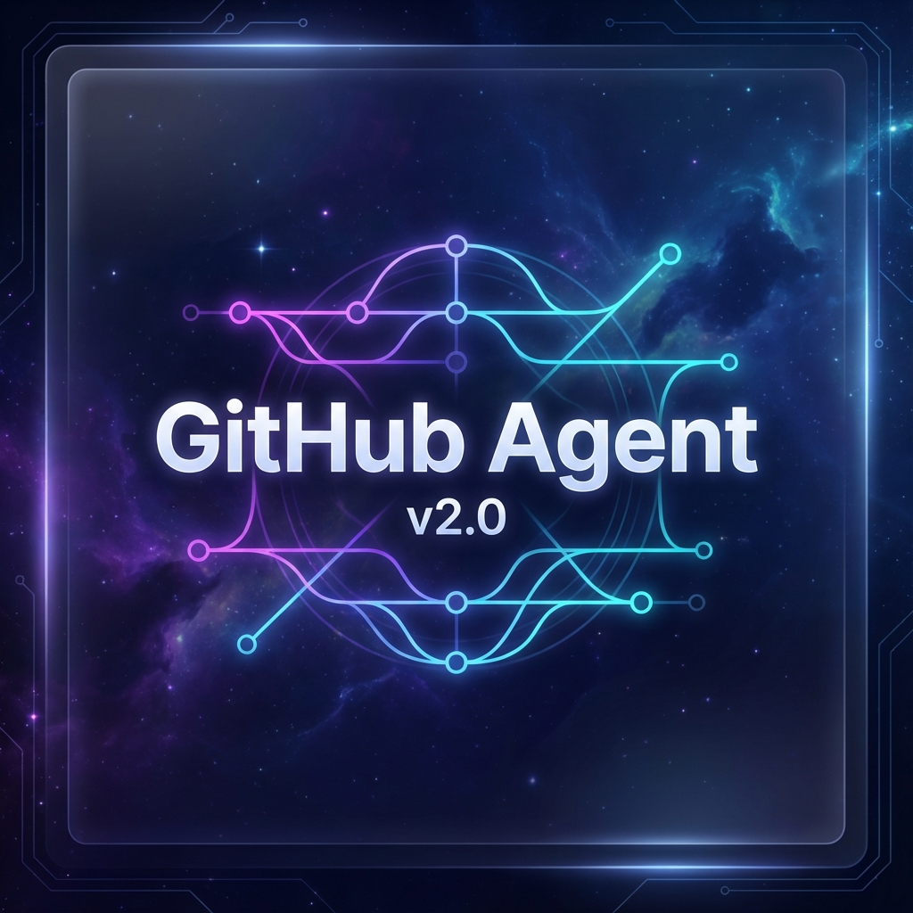

# GitHub Agent v2.0

<div align="center">
  
  
  
  
  
  

  <h3>10x faster operations. AI-powered intelligence.<br>Built by developers, for developers who demand excellence.</h3>

  <p>
    <a href="#demo"><strong>See the Speed</strong></a> •
    <a href="#features"><strong>Intelligence</strong></a> •
    <a href="#pricing"><strong>Pricing</strong></a> •
    <a href="docs/setup/SETUP.md"><strong>Get Access</strong></a>
  </p>
</div>

---

## ⚡ See the difference speed makes

Real performance comparisons with standard GitHub CLI.

| Operation | GitHub CLI | Agent v2.0 | Improvement |
| :--- | :---: | :---: | :---: |
| **Clone + Analyze** | 🔴 45s | 🟢 **4.2s** | 🟣 **10.7x faster** |
| **Multi-repo sync** | 🔴 3m 20s | 🟢 **18s** | 🟣 **11.1x faster** |
| **Smart commit** | 🔴 12s | 🟢 **1.1s** | 🟣 **10.9x faster** |

## 🖥️ Interactive Experience

```bash
$ github-agent analyze --repo react --performance

🤖 AI Analysis starting...
✅ Repository cloned (1.2s)
✅ Dependencies analyzed (0.8s)
✅ Performance metrics calculated (0.3s)
✅ Security scan completed (0.5s)

⚡ Total time: 2.8s (vs 45s with GitHub CLI)
> Press any key to see AI suggestions...
```

---

## 🧠 Intelligence that understands your code

###  Context-Aware Commits
AI analyzes your changes and generates perfect commit messages that follow best practices.
> *Suggested commit: "feat(auth): implement OAuth2 with JWT tokens"*

###  Predictive Analysis
Spot issues before they become problems with AI-powered code health prediction.
> *⚠️ Potential memory leak detected in utils/cache.js*

###  Smart Automation
Learns your patterns and optimizes workflows automatically for maximum efficiency.
- Auto-sync with main branch
- Run tests before commit
- Update dependencies weekly

---

## 💎 Pricing Plans

Simple, transparent pricing.

| Feature | Individual | Team (Best Value) | Enterprise |
| :--- | :---: | :---: | :---: |
| **Price** | **$99** /mo | **$499** /mo | **Custom** |
| **Repos** | Unlimited | Unlimited | Unlimited |
| **Users** | 1 Developer | Up to 10 | Unlimited |
| **Support** | Priority | 24/7 Premium | Dedicated Manager |
| **Security** | Standard | Advanced | SSO + Audit Logs |

<div align="center">
  <br>
  <h3>🚀 Ready to transform your GitHub workflow?</h3>
  <a href="docs/setup/SETUP.md">
    
  </a>
</div>

---

<div align="center">
  <p>© 2024 GitHub Agent v2.0. All rights reserved.</p>
  <p>
    <a href="LICENSE">License</a> •
    <a href="docs/CONTRIBUTING.md">Contributing</a> •
    <a href="docs/setup/CONFIGURATION.md">Documentation</a>
  </p>
</div>
