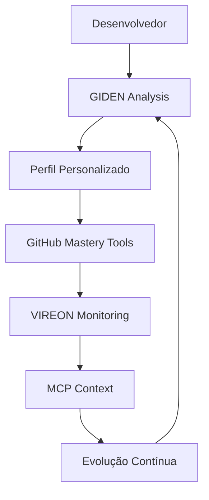

# 🌐 Integração do Ecossistema: GIDEN + VIREON + GitHub Mastery

## 🎯 Visão Unificada

Nossa missão é criar um ecossistema completo que democratize o desenvolvimento e maximize o potencial de cada desenvolvedor.

## 🔗 Componentes Integrados

### 1. GitHub Mastery

**Papel**: Toolkit de automação e ferramentas

- CLI tools para operações GitHub
- API client robusto
- Webhook server
- Automações prontas

### 2. GIDEN Adaptive Developer

**Papel**: IA personalizada para crescimento

- Análise de perfil adaptativa
- Estratégias personalizadas
- Evolução contínua
- Aprendizado coletivo

### 3. VIREON Integration

**Papel**: Orquestração e evolução sistêmica

- Integração simbiótica
- Monitoramento contínuo
- Validação de qualidade
- Preservação de conhecimento

### 4. MCP Ecosystem

**Papel**: Contexto e ferramentas avançadas

- Model Context Protocol
- Ferramentas especializadas
- Integração com IDEs
- Análise avançada

## 🔄 Fluxo de Integração



## 💡 Casos de Uso Integrados

### 1. Onboarding Inteligente

```javascript
// GIDEN analisa o desenvolvedor
const profile = await GIDEN.analyzeDeveloper(user);

// GitHub Mastery configura ferramentas
await GitHubMastery.setupTools(profile);

// VIREON monitora progresso
await VIREON.startMonitoring(user, profile);

// MCP fornece contexto
const context = await MCP.getRelevantContext(profile);
```

### 2. Evolução Adaptativa

```javascript
// VIREON detecta oportunidade
const opportunity = VIREON.detectGrowthOpportunity();

// GIDEN adapta estratégia
const newStrategy = GIDEN.adaptStrategy(opportunity);

// GitHub Mastery ajusta automações
GitHubMastery.updateAutomations(newStrategy);

// MCP atualiza ferramentas
MCP.updateToolset(newStrategy);
```

### 3. Contribuição Otimizada

```javascript
// MCP encontra projetos ideais
const projects = MCP.findIdealProjects(profile);

// GIDEN sugere abordagem
const approach = GIDEN.suggestApproach(projects);

// GitHub Mastery automatiza processo
const pr = GitHubMastery.createOptimizedPR(approach);

// VIREON valida qualidade
VIREON.validateContribution(pr);
```

## 📊 Métricas Unificadas

### Dashboard Integrado

- **GIDEN**: Taxa de crescimento pessoal
- **GitHub Mastery**: Automações executadas
- **VIREON**: Qualidade e integridade
- **MCP**: Contexto utilizado

### KPIs do Ecossistema

1. **Velocidade de Crescimento**: 3x mais rápido
2. **Qualidade de Contribuições**: 85%+ aprovação
3. **Retenção de Conhecimento**: 95%+ preservado
4. **Satisfação do Desenvolvedor**: 90%+ positivo

## 🚀 Implementação Prática

### Passo 1: Setup Inicial

```bash
# Clone todos os componentes
git clone https://github.com/NEO_SH1W4/github-mastery.git
git clone https://github.com/NEO_SH1W4/mcp-ecosystem.git
git clone https://github.com/NEO_SH1W4/giden.git

# Instale dependências
npm install -g @ecosystem/cli
```

### Passo 2: Configuração Integrada

```bash
# Execute o setup wizard
ecosystem setup --profile developer

# Conecte suas contas
ecosystem connect github
ecosystem connect mcp
```

### Passo 3: Ativação

```bash
# Inicie análise personalizada
ecosystem start --mode adaptive

# Ou modo específico
ecosystem giden analyze
ecosystem vireon monitor
ecosystem github automate
```

## 🌟 Benefícios da Integração

### Para o Desenvolvedor

1. **One-Stop Solution**: Tudo em um lugar
2. **Sinergia**: Componentes se potencializam
3. **Evolução Holística**: Crescimento em todas as áreas
4. **Suporte 360°**: Cobertura completa

### Para a Comunidade

1. **Padrão Aberto**: Todos podem contribuir
2. **Conhecimento Compartilhado**: Aprendizado coletivo
3. **Qualidade Elevada**: Melhores contribuições
4. **Crescimento Acelerado**: Mais devs ativos

## 🔮 Roadmap de Integração

### Q3 2025

- [ ] API unificada do ecossistema
- [ ] Dashboard web integrado
- [ ] Mobile app companion
- [ ] Plugins para IDEs populares

### Q4 2025

- [ ] AI Assistant unificado
- [ ] Marketplace de automações
- [ ] Certificação integrada
- [ ] Eventos da comunidade

### 2026

- [ ] Expansão internacional
- [ ] Parcerias corporativas
- [ ] Programa de mentoria
- [ ] Sustentabilidade financeira

## 🤝 Como Contribuir

### Desenvolvimento

```markdown
1. Escolha um componente
2. Fork e clone
3. Crie feature branch
4. Implemente com testes
5. Abra PR detalhado
```

### Documentação

- Traduções necessárias
- Exemplos práticos
- Tutoriais em vídeo
- Case studies

### Comunidade

- Organize meetups locais
- Crie conteúdo educativo
- Mentore iniciantes
- Compartilhe experiências

## 📈 Impacto Projetado

### 6 Meses

- 1,000+ desenvolvedores ativos
- 50+ empresas usando
- 10,000+ PRs de qualidade

### 1 Ano

- 10,000+ desenvolvedores
- 500+ empresas
- 100,000+ contribuições

### 3 Anos

- Padrão da indústria
- Presente em universidades
- Mudando vidas globalmente

## 🎉 Conclusão

Este ecossistema integrado representa mais do que ferramentas - é uma revolução na forma como desenvolvedores crescem e contribuem para o open source.

**Juntos, estamos:**

- Democratizando o conhecimento
- Acelerando carreiras
- Fortalecendo comunidades
- Transformando o mundo do desenvolvimento

### 🚀 Comece Agora!

```bash
# Uma linha para começar tudo
npx @ecosystem/cli init --full

# Ou visite
https://ecosystem.dev/start
```

---

**"Sozinhos vamos rápido, juntos vamos longe. Com IA, vamos além."**

_Criado pela união de mentes brilhantes, para o futuro do desenvolvimento_
